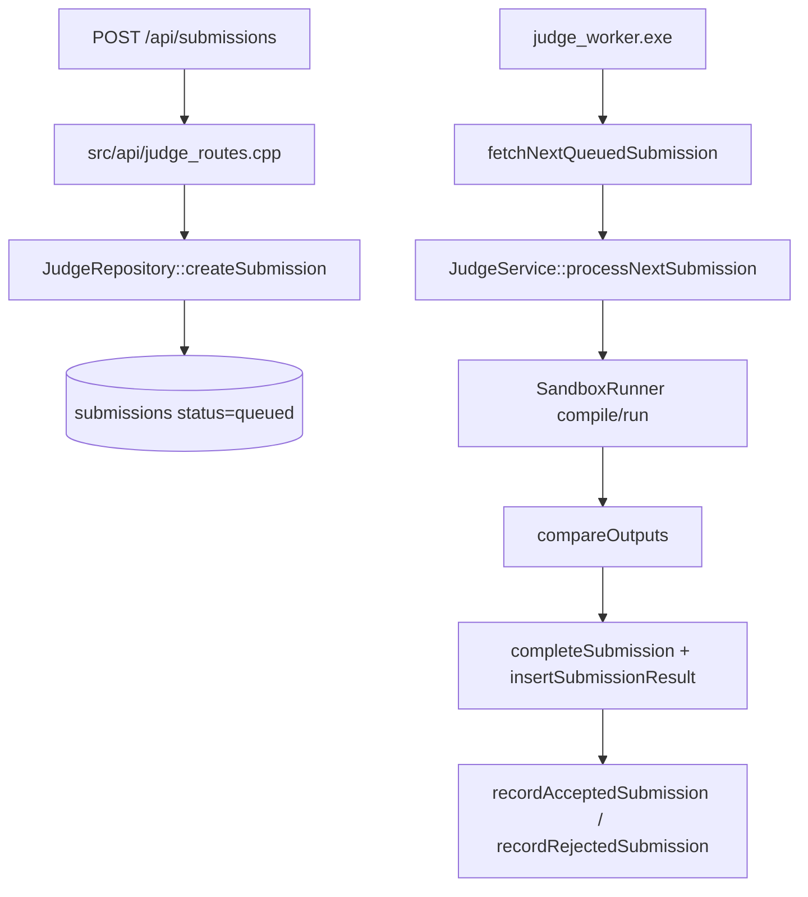

# Judge 评测引擎

配套图：

- [05-judge-pipeline.drawio](diagrams/05-judge-pipeline.drawio)

## 主链路

Judge 系统由 API server 入队、独立 worker 出队执行。API server 不负责编译运行用户代码，只把 submission 持久化为 `queued`。

这个拆分让 HTTP 请求保持快速返回，也让评测执行可以通过单独进程扩容、重启或使用 `--once` 模式做任务处理。

## API 侧职责

源码：`src/api/judge_routes.cpp`

主要路由包括：

- Judge 配置：`GET/PUT /api/problems/{id}/judge-config`
- 测试点：`GET/POST /api/problems/{id}/test-cases`、导入、更新、删除、生成 expected output
- 提交：`POST /api/submissions`
- 查询：`GET /api/submissions/{id}`、`GET /api/problems/{id}/submissions`
- 重测：`POST /api/submissions/{id}/rejudge`

Admin 写路由通过 `X-Admin-Token` 和 `requireAdmin()` 保护。提交源码只支持 C++，并限制源码大小。

## Worker 侧职责

源码：`src/judge_worker_main.cpp`、`src/service/judge_service.cpp`

worker 启动后循环调用 `JudgeService::processNextSubmission()`：

1. `JudgeRepository::fetchNextQueuedSubmission()` 获取一个待评测提交。
2. 检查 judge config 是否存在且启用。
3. 检查 submission/config 语言是否都是 `cpp`。
4. 加载实际用于评测的 test cases。
5. 创建临时工作目录，调用 `SandboxRunner::compile()`。
6. 编译失败返回 `CE` 或 `JE`。
7. 逐个测试点调用 `SandboxRunner::run()`，并用 `compareOutputs()` 判定。
8. 首个非 AC 测试点会决定最终 verdict 并停止后续测试。
9. 写入 `submission_results`，完成 `submissions`，再回写训练进度。
10. 删除临时工作目录。

异常会被捕获并转为 `JE`，避免 worker 进程因为单个提交崩溃。

## SandboxRunner

源码：`include/judge/sandbox_runner.hpp`、`src/judge/sandbox_runner.cpp`

`SandboxRunner` 有两种模式：

- `Docker`：默认使用 Docker 镜像，例如 `gcc:13`，并限制网络、CPU、内存、进程数等。
- `Local`：仅在开发环境显式允许时使用，便于本地测试。

配置来源由 `SandboxRunner::fromEnvironment()` 决定，常见变量包括：

- `ATP_JUDGE_DOCKER_IMAGE`
- `ATP_JUDGE_ALLOW_LOCAL`

## 输出比较策略

源码：`src/judge/output_comparator.cpp`

`compareOutputs()` 根据 `JudgeConfig::compare_mode` 选择比较方式：

- `exact`：完全一致。
- `trim_trailing`：忽略行尾/末尾多余空白。
- `ignore_whitespace`：按 token 比较。
- `float_epsilon`：数字按误差比较，文本 token 保持一致。

这不是独立类层级，但在行为上是策略模式：配置决定比较策略，调用方只关心是否 accepted 和错误信息。

## 结果回写

评测结束后有两类写入：

- 评测事实：`submissions`、`submission_results`。
- 训练进度副作用：`recordAcceptedSubmission()` 或 `recordRejectedSubmission()` 更新题目完成/错题状态、训练计划 item 状态和相关记录。

这让在线评测不只是判题工具，还会直接推动训练计划状态变化。例如同一道计划题 AC 后，相关 `training_plan_items.item_status` 可以变成 `completed`。

## 源码锚点

- `src/api/judge_routes.cpp`：提交、配置、测试点、重测路由。
- `include/service/judge_service.hpp`、`src/service/judge_service.cpp`：worker 主流程。
- `include/repository/judge_repository.hpp`、`src/repository/judge_repository.cpp`：队列、提交、测试点、结果和进度写回。
- `include/judge/sandbox_runner.hpp`、`src/judge/sandbox_runner.cpp`：沙箱执行。
- `include/judge/output_comparator.hpp`、`src/judge/output_comparator.cpp`：输出比较。
- `sql/003_judge.sql`：评测相关表结构。
- `tests/test_main.cpp`：AC、WA、CE、TLE 的集成测试场景。

