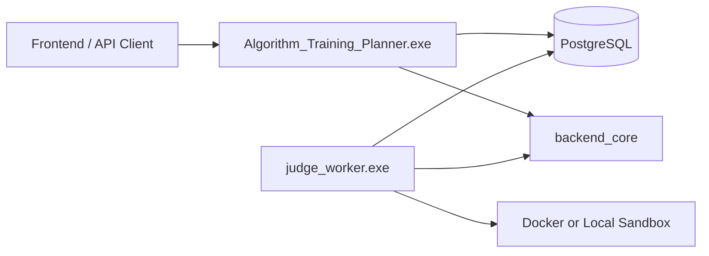

# 项目整体架构

配套图：

- [01-system-context.drawio](diagrams/01-system-context.drawio)
- [02-layered-architecture.drawio](diagrams/02-layered-architecture.drawio)

## 一句话结构

这是一个 C++23 REST 后端，API server 负责同步 HTTP 请求，judge worker 负责异步评测队列；两者共享 PostgreSQL、Repository、Judge/Training 领域模型和 `backend_core` 静态库。

## 两个可执行程序

| 程序 | 源码入口 | 主要职责 |
| --- | --- | --- |
| `Algorithm_Training_Planner.exe` | `src/main.cpp` | 确保数据库存在、初始化 schema/seed、创建连接池、注册 Crow 路由、启动多线程 HTTP server |
| `judge_worker.exe` | `src/judge_worker_main.cpp` | 初始化数据库、轮询 queued submission、调用 `JudgeService::processNextSubmission()`、空闲时短暂 sleep |

两个程序都依赖同一个 `backend_core`。这个设计把 Web 入口和后台 worker 拆开，但让领域逻辑、Repository、DB 基础设施共用同一份实现。

## 分层依赖

| 层 | 代码位置 | 依赖方向 | 读源码重点 |
| --- | --- | --- | --- |
| API | `include/api/*`、`src/api/*` | 调用 Service 和 Repository | 路由注册、JSON 解析、权限、HTTP 状态码 |
| Service | `include/service/*`、`src/service/*` | 调用 Repository、Algorithm、Judge infra | 用例编排，不直接写 SQL |
| Algorithm | `include/algorithms/*`、`src/algorithms/*` | 只依赖 domain 模型 | 可测试、可替换、无数据库副作用 |
| Repository | `include/repository/*`、`src/repository/*` | 调用 ConnectionPool/libpqxx | SQL、事务、状态联动 |
| DB Infra | `include/db/*`、`src/db/*`、`sql/*.sql` | 封装 PostgreSQL 连接和初始化 | 建库建表、连接池、RAII |
| Judge Infra | `include/judge/*`、`src/judge/*` | 调用系统命令或 Docker | 编译运行、沙箱模式、输出比较 |
| Domain | `include/domain/*` | 被所有业务层共享 | 领域字段和跨层数据边界 |

依赖基本保持单向：入口层向内调用，算法层不感知 Web 或数据库，Repository 层封装持久化细节。这让核心算法可以在 `tests/test_main.cpp` 里直接构造对象测试。

## API 请求链路

典型同步请求的路径是：

1. Crow 路由在 `src/api/routes.cpp` 或 `src/api/judge_routes.cpp` 接收请求。
2. API 层解析 query/body，必要时调用 `requireAdmin()`。
3. 简单 CRUD 直接调用 Repository；复杂用例交给 Service。
4. Repository 用 `ConnectionPool::acquire()` 拿到 `ConnectionLease`，在事务内执行 SQL。
5. 领域对象通过 `src/api/json_utils.cpp` 或 `src/api/judge_json.cpp` 转成 JSON 返回。

训练计划生成和提交评测是两个例外：它们会触发更长的业务链路，分别见 [training-plan-engine.md](training-plan-engine.md) 和 [judge-engine.md](judge-engine.md)。

## 启动初始化

`src/main.cpp` 和 `src/judge_worker_main.cpp` 都会调用：

- `Database::ensureDatabase()`：确保目标 PostgreSQL database 存在。
- `Database::initializeSchemaAndSeed()`：通过 `SchemaInitializer` 检查表、执行 `sql/001_schema.sql`、`sql/003_judge.sql` 和必要 seed。
- `ConnectionPool`：为后续 Repository 访问提供连接复用。

这样 API server 和 worker 都能独立启动，任何一个进程启动时都能把数据库带到可用状态。

## 源码锚点

- `CMakeLists.txt`：`backend_core`、API server、judge worker 的构建关系。
- `src/main.cpp`：HTTP 进程装配。
- `src/judge_worker_main.cpp`：worker 轮询模型。
- `include/api/app.hpp`：`ApiApp = crow::App<crow::CORSHandler>`。
- `include/domain/models.hpp`、`include/domain/judge_models.hpp`：跨层数据结构。

