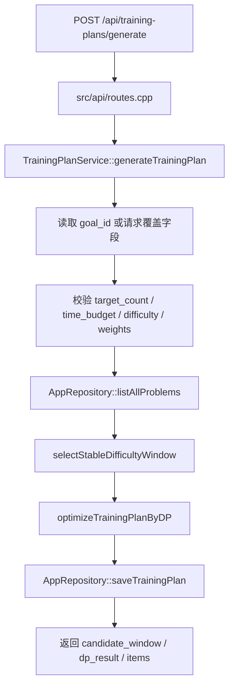

# 训练计划生成引擎

配套图：

- [03-training-plan-generation.drawio](diagrams/03-training-plan-generation.drawio)
- [04-algorithm-internals.drawio](diagrams/04-algorithm-internals.drawio)

## 主流程

入口是 `POST /api/training-plans/generate`，路由在 `src/api/routes.cpp` 注册，核心实现是 `TrainingPlanService::generateTrainingPlan()`。

这个流程把“用户目标”拆成两步：先用滑动窗口选出难度稳定、标签覆盖尽可能好的候选池，再用 DP 在时间和数量约束下挑选最终题目。

## 目标读取与覆盖

`TrainingPlanService::goalFromGenerateRequest()` 支持两种输入：

- 请求带 `goal_id`：先从 `AppRepository::getTrainingGoal()` 读取已保存目标。
- 请求直接带目标字段：通过 `applyGoalOverrides()` 覆盖默认值或已保存目标。

这样前端可以复用目标模板，也可以在生成时临时改时间预算、目标标签、权重等字段。

## 滑动窗口候选池

源码：`src/algorithms/window_selector.cpp`

核心思想来自双指针：

1. 按 `difficulty` 过滤并稳定排序，难度相同按 `id`。
2. 统计目标标签中实际存在于题库的集合，避免永远等不到不存在标签。
3. 右指针持续扩张窗口，`WindowStats` 维护标签计数、错题数、薄弱标签命中数。
4. 当窗口同时满足候选数量和可覆盖标签要求时，尝试更新最优窗口，然后左指针收缩。
5. 没有合法窗口时退回到过滤后的全集。

候选池规模由 `desired_candidate_count()` 控制：至少 `target_count`，优先取 `target_count * 3`，上限 `80`。这个上限和后续 DP 的 `kMaxDpCandidates` 对齐，避免计划生成退化成过大的组合搜索。

窗口优先级在 `better_window()` 中体现：

- 难度跨度更小优先。
- 覆盖目标标签更多优先。
- 如果用户偏好错题，错题数更多优先。
- 如果用户偏好薄弱标签，薄弱标签命中更多优先。
- 最后选择候选数量更小的窗口。

复杂度主要是排序 `O(n log n)` 加线性扫描 `O(n)`。

## 压缩 DP 优化器

源码：`src/algorithms/training_dp.cpp`

DP 的目标是在 `time_budget_minutes` 和 `target_count` 内最大化题目得分，同时尽量覆盖核心标签。

关键约束：

- `kMaxDpCandidates = 80`：候选题最多进入 DP 80 道。
- `kMaxMaskTags = 8`：标签覆盖用 bitmask 表示，最多跟踪 8 个核心标签。
- 状态为 `dp[t][k][mask]`：耗时 `t`、选题数 `k`、已覆盖标签集合 `mask` 的最佳得分。
- `State` 中用两个 64-bit bitset 记录被选题目，便于最终恢复选题列表。

得分由 `scoreProblemForGoal()` 计算，主要来源包括目标标签命中、错题偏好、薄弱标签、难度中心距离和预计耗时惩罚。最终结果通过 `result_from_state()` 还原成 `SelectedProblem`，并生成中文 `selected_reason`。

## 对比算法接口

`TrainingPlanService` 还提供两个对比接口，服务于展示和论文答辩：

- `compareWindowAlgorithms()`：对比滑动窗口和朴素枚举；朴素算法最多采样 500 题，避免接口过慢。
- `compareDpAlgorithms()`：对比动态规划和贪心选题，并返回时间预算内表现。

这些对比接口复用同一批 domain 模型和算法函数，因此可以清楚展示“竞赛算法如何被工程模块化”。

## 保存与返回

`AppRepository::saveTrainingPlan()` 会保存：

- `training_plans`：计划摘要、候选数量、总分、算法摘要 JSON。
- `training_plan_items`：最终选择题目、顺序、分数、原因、初始状态。

随后 `repository_.getTrainingPlanItems(plan_id)` 读回持久化后的 item，确保响应里的 `plan_item_id` 等字段和数据库一致。

## 源码锚点

- `src/api/routes.cpp`：`/api/training-plans/generate` 路由。
- `include/service/training_plan_service.hpp`、`src/service/training_plan_service.cpp`：主用例编排。
- `include/algorithms/window_selector.hpp`、`src/algorithms/window_selector.cpp`：候选池选择。
- `include/algorithms/training_dp.hpp`、`src/algorithms/training_dp.cpp`：DP、贪心和评分函数。
- `include/domain/models.hpp`：`TrainingGoal`、`CandidateWindow`、`TrainingPlanResult`、`SelectedProblem`。
- `tests/test_main.cpp`：滑动窗口、DP 和 DB 保存行为的测试样例。

